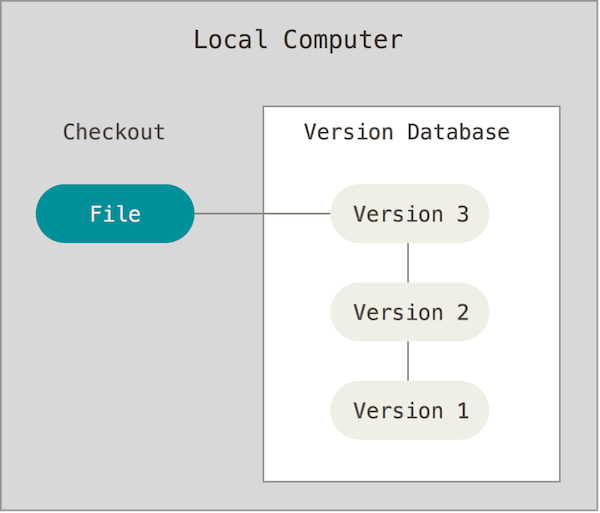
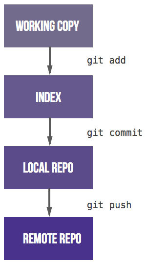

% Quick review of Git
% Pierre Navaro
% Institut de Mathematique de Rennes

# About Dropbox

- Dropbox versioning is not free.
- Only keep your edits over a period of 30 days.
- Privacy and Security ?
- No differences display.
- The service have the right to delete information from free and inactive accounts.
- Users are not allowed to perform encryption.

# New products based on a git server for collaborating writing.

- ShareLaTeX (https://fr.sharelatex.com)
- Authorea (https://www.authorea.com)
- Overleaf (https://www.overleaf.com)

# About Version Control

- Records changes to a file or set of files over time.
- You can recall specific versions later.
- You can use it with nearly any type of file on a computer.
- This is the better way to collaborate on the same document.
- Every change is committed with an author and a date.
- Figures are downloaded from [Pro Git book](http://git-scm.com/book).
- "Become a git guru" tutorial (https://www.atlassian.com/git/tutorials).

# Local Version Control Systems



- One of the most saving popular was a system called RCS
- Available with the Developer Tools with Mac OS X
- Collaboration is not really possible.

# Centralized Version Control Systems


- Clients check out files from a central place.
- You know what everyone else on the project is doing
- A single server contains all the versioned files.
- For many years, this has been the standard (CVS, SVN).
- You always need network connection.
- If the server is corrupted, with no backup, you lose everything !

# Distributed Version Control Systems


- Clients fully mirror the repository.
- You can collaborate with different groups of people in different ways simultaneously within the same project.
- No need of network connection.
- Multiple backups.

# Configure Git

```bash
git config ---global user.name "Pierre Navaro"
git config ---global user.email "pierre.navaro@univ-rennes1.fr"
git config ---global core.editor mvim
git config ---global merge.tool opendiff
```

```bash
git config ---list
   user.name=Pierre Navaro
   user.email=pierre.navaro@univ-rennes1.fr
   core.editor=mvim
   merge.tool=opendiff
```

Settings are saved on the computer for all your git repositories.

# Four File status in the repository


# Initializing a Repository in an Existing Directory

```bash
ls article
```
```
document.tex	figure.png
```
git init
```
Initialized empty Git repository in /Users/navaro/article/.git/
```
git status
On branch master
Initial commit
Untracked files:
  (use "git add <file>..." to include in what will be committed)

	document.tex
	figure.png

nothing added to commit but untracked files present
(use "git add" to track)
```
# Adding files in your repository

git add document.tex
git add figure.png
git status
On branch master
Initial commit
Changes to be committed:
  (use "git rm --cached <file>..." to unstage)

	new file:   document.tex
	new file:   figure.png

git commit -m 'Initial project version'}@>
[master (root-commit) 9d23b49] Initial project version
 2 files changed, 0 insertions(+), 0 deletions(-)
 create mode 100644 document.tex
 create mode 100644 figure.png


# Cloning a New Directory

```
git clone git@git.math.cnrs.fr:plm/navaro/projet
Cloning into 'projet'...
Initialized empty Git repository in /git/repositories/plm/navaro/projet.git/
warning: You appear to have cloned an empty repository.
Checking connectivity... done.
```

Now you can add and commit your files.

```
cd projet
./article/*
git add document.tex
git add figure.png
git commit -m 'Initial version of the project'

Your files are NOT present on the server!

git status
On branch master
Your branch is based on 'origin/master', but the upstream is gone.
  (use "git branch --unset-upstream" to fixup)
nothing to commit, working directory clean
```

# Synchronizing your files on the server

 By default you are on the "master" branch.

```
git branch
* master
Upload your files to the server:
git push origin master
To git@git.math.cnrs.fr:plm/navaro/projet
 * [new branch]      master -> master
```

# Git Workflow


# Cloning an Existing Directory
Now i change my computer.
```
git clone git@git.math.cnrs.fr:plm/navaro/projet
Cloning into 'projet'...
remote: Counting objects: 3, done.
remote: Compressing objects: 100% (2/2), done.
remote: Total 3 (delta 0), reused 0 (delta 0)
Receiving objects: 100% (3/3), 246 bytes | 0 bytes/s, done.
Checking connectivity... done.
cd projet
ls
document.tex	figure.png
git log
commit 7cef21ac9119ef2fb97065c9e5549550e2f603fd
Author: Pierre Navaro <pierre.navaro@univ-rennes1.fr>
Date:   Fri Oct 2 13:51:43 2015 +0200

    Initial version of the project
```

# Display and Create a Branch

Display all branches :
```
git branch -a
* master
  remotes/origin/HEAD -> origin/master
  remotes/origin/master
```

Create your own branch and switch:
```
git branch pierre-branch}@>
git checkout pierre-branch}@>
```

Switched to branch 'pierre-branch'

```
git branch
  master
* pierre-branch
Files could be different or non existant between branches but are at the same place on the file system


# Contributing

Modify the file document.tex

```
git status
On branch pierre-branch
Changes not staged for commit:
  (use "git add <file>..." to update what will be committed)
  (use "git checkout -- <file>..." to discard changes in working directory)
	modified:   document.tex
no changes added to commit (use "git add" and/or "git commit -a")

```
git diff
diff --git a/document.tex b/document.tex
index a608114..e69de29 100644
--- a/document.tex
+++ b/document.tex
@@ -1,3 +0,0 @@
-Exemple Git pour la journee de rentree

# Locally saving your modifications

```
git add document.tex
```
Checking which files are ready to be committed.

```
git status
On branch pierre-branch
Changes to be committed:
  (use "git reset HEAD <file>..." to unstage)
	modified:   document.tex
```
Now save your work on the local branch.

```
git commit -m 'Some modification is available
[pierre-branch 8c6bf81] Some modification is available
 1 file changed, 3 insertions(+)
```

# Fast commit


Use it carefully!

How to share your work and make it available on the server?

# Option 1 : Merge to the main branch and push

```
git checkout master
Switched to branch 'master'
Your branch is up-to-date with 'origin/master'.
git merge pierre-branch
Updating 7cef21a..8c6bf81
Fast-forward
 document.tex | 3 +++
 1 file changed, 3 insertions(+)
git push origin master
Counting objects: 3, done.
Delta compression using up to 8 threads.
Compressing objects: 100% (3/3), done.
Writing objects: 100% (3/3), 351 bytes | 0 bytes/s, done.
Total 3 (delta 0), reused 0 (delta 0)
To git@git.math.cnrs.fr:plm/navaro/projet
   7cef21a..8c6bf81  master -> master
```

# Option 2 : Push your branch to the server

```
git checkout pierre-branch
Switched to branch 'pierre-branch'
git push origin pierre-branch
Total 0 (delta 0), reused 0 (delta 0)
To git@git.math.cnrs.fr:plm/navaro/projet
 * [new branch]      pierre-branch -> pierre-branch
git branch -a
  master
* pierre-branch
  remotes/origin/HEAD -> origin/master
  remotes/origin/master
  remotes/origin/pierre-branch
```

# Updating from the Repository

The master branch has changed. To get all new updates :

```
git checkout master      (change to master)
Switched to branch 'master'
git fetch origin         (download changes from repository)
git merge origin/master  (update local branch master)
git checkout pierre-branch (back to your branch)
Switched to branch 'pierre-branch'
git merge master          (update your branch)
If you have conflict, no problem just do :
git mergetool
A nice editor helps you to choose the right version. Close and :
git commit -m 'Update and fixed conflicts'
```

# Git cycle on a single branch


# Progressive-stability branching


# GitHub Desktop - Modifications view


# GitHub Desktop - History view


# Why Git?

- Tracking and controlling changes in the software.
- Branches : Frictionless Context Switching, Role-Based Codelines.
- Everything is local : Git is fast.
- Multiple Backups.
- It's impossible to get anything out of Git other than the exact bits you put in.
- Staging Area : intermediate index between working directory and repository.

## Why not 
- Sometimes confusing for new users.
- Crazy command line syntax
- Simple tasks need so many commands
- Git history is a bunch of lies
- Power for the maintainer, at the expense of the contributor.

# Some hints.

- Install bash-completion and source git-prompt.sh.
- use [GitHub Desktop](https://desktop.github.com/)

- Showing which files have changed between git branches
```git
git diff --name-status master..branch
```
- Compare the master version of a file to my current branch version
```git
git diff mybranch master -- myfile.F90
```
